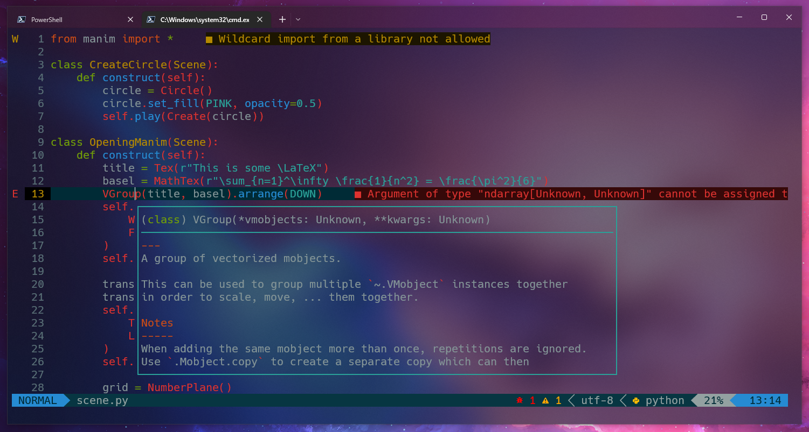

# Dotfiles
My personal dotfiles for fish (linux) and powershell (windows).

## Contents

### For Microsoft users

#### Powershell setup

- [Nerd fonts](https://github.com/ryanoasis/nerd-fonts) - Font aggregator, collection and patcher.
- [Scoop](https://scoop.sh/) - A command-line installer for Windows.
- [Git for Windows](https://gitforwindows.org/) - Version control software. 
- [Oh My Posh](https://ohmyposh.dev/) - Prompt theme engine usefull for any shell.
- [Terminal Icons](https://github.com/devblackops/Terminal-Icons) - A PowerShell module to show file and folder icons in the terminal.
- [PSReadLine](https://docs.microsoft.com/en-us/powershell/module/psreadline/) - Module with a lot of cool stuff. Used for the autocompletition feature.
- [z](https://www.powershellgallery.com/packages/z) - Directory jumper ported from the z bash shell script.

#### Neovim setup

**WARNING: Requieres nvim version >= 0.5**

- [Vim-plug](https://github.com/junegunn/vim-plug) - A minimalist plugin managers for vim.
- [Lightline](https://github.com/itchyny/lightline.vim) - A configurable statusline and tabline plugin for vim.
- [Vim-gitbranch](https://github.com/itchyny/vim-gitbranch) - Plugin that provides a function which returns the name of the current git branch. Used to integrate git branch info to the lightline statusline.
- [NERDTree](https://github.com/preservim/nerdtree) - File system explorer for vim.

